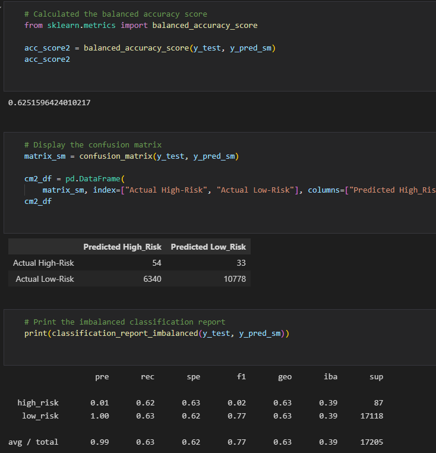
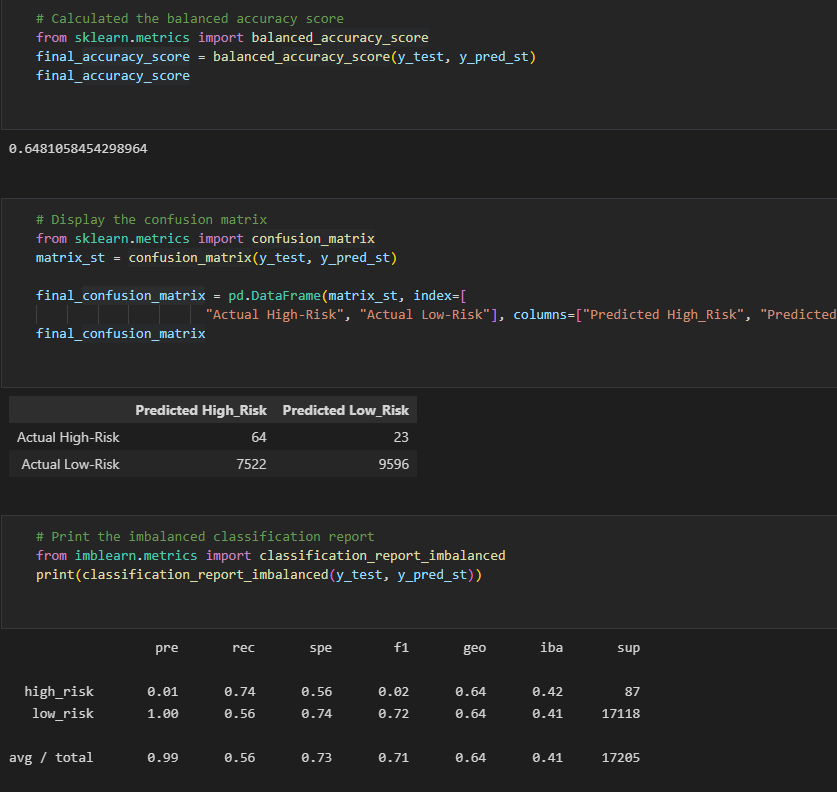

# Credit_Risk_Analysis

## Overview of the analysis:

Using the credit card credit dataset from LendingClub, a peer-to-peer lending services company, I oversampled the data using the RandomOverSampler and SMOTE algorithms, and undersampled the data using the ClusterCentroids algorithm. Then, I used a combinatorial approach of over- and undersampling using the SMOTEENN algorithm. Next, I compared two new machine learning models that reduce bias, BalancedRandomForestClassifier and EasyEnsembleClassifier, to predict credit risk. Once done, I evaluated the performance of these models and make a written recommendation on whether they should be used to predict credit risk.

## Results: 
  - The balanced accuracy score for BalanceRandomForestClassifier is .80

  - The balanced accuracy score for the EasyEnsembleClassifier is .86
  
  
  
  - The balanced accuracy score for the LogisticRegression is .67
  
   
  
  
  - The balanced accuracy score for the SMOTE Oversampling is .62

    
    
    
  - The balanced accuracy score for the SMOTE Under Sampling is .51

  - The balanced accuracy score for the Combination (Over and Under) Sampling is .65
  

## Summary: 

The best classifier would be the EasyEnsembleClassifier since the accuracy score was the closest to 1.0 which would give it the most accuracte score out of them all.
 I would definately recommend this one compared to the others.

